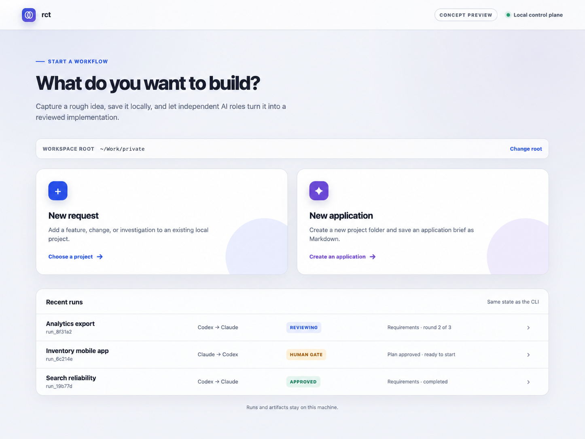

# rct

rct is a local orchestrator for AI-assisted software development. It turns a rough request into a structured workflow for requirements, architecture, implementation planning, implementation, verification, review, and revision.

Codex and Claude Code do not call each other recursively. A central workflow engine written in Go assigns roles, invokes each provider, validates artifacts, evaluates approval gates, and persists the state required to continue safely.

## Concept preview

The local browser control plane is currently a documented design target, not a released interface. The capture below shows the intended entry point for creating a request or a new application.



## How it works

rct separates the workflow into three independent roles:

- **Designer** — clarifies the request and produces requirements, architecture, and implementation plans.
- **Implementer** — implements one approved milestone at a time and addresses required changes.
- **Reviewer** — independently evaluates artifacts, code changes, and verification results.

The provider that receives the initial request can be selected with `--designer codex` or `--designer claude`. With the two-provider MVP, the selected provider is assigned to the Designer and Implementer roles in separate sessions, while the other provider becomes the independent Reviewer.

```text
Rough request
    -> Designer artifact
    -> Independent review
    -> Revision when required
    -> Deterministic gate
    -> Next workflow phase
```

## Core principles

- Artifacts, schemas, job IDs, and hashes are authoritative; terminal text is not.
- Designer, Implementer, and Reviewer use separate role IDs and agent sessions.
- The Reviewer provider must differ from the Designer and Implementer provider.
- Review and revision loops are finite and never auto-approve at their retry limit.
- Provider adapters, runtime backends, and workflow logic remain separate.
- A reviewer verdict, a deterministic gate pass, and human authorization are distinct records.
- Human approval cannot override stale artifacts, failed verification, or required changes.
- Destructive Git operations, deployment, and merge actions are never implicit.

## Requirements

- macOS or Linux
- Codex CLI installed and authenticated
- Claude Code CLI installed and authenticated
- Go 1.23 or later when building from source

Herdr and tmux are optional. rct can fall back to direct process execution when neither is available.

## Install

Install from a local clone. By default, this writes `rct` to `~/.local/bin`:

```bash
make install
```

Ensure the install directory is on `PATH`:

```bash
export PATH="$HOME/.local/bin:$PATH"
```

Use a different prefix when needed:

```bash
make install PREFIX=/usr/local
```

Remove only the installed binary:

```bash
make uninstall
```

After the first tagged GitHub Release is available, the checksum-verifying binary installer can be used without
a Go toolchain:

```bash
curl -fsSL https://raw.githubusercontent.com/hironeko/rct/main/scripts/install.sh | sh
```

Set `RCT_VERSION` to install a specific release, or `RCT_INSTALL_DIR` to select another destination:

```bash
curl -fsSL https://raw.githubusercontent.com/hironeko/rct/main/scripts/install.sh | \
  RCT_VERSION=v0.5.0 RCT_INSTALL_DIR="$HOME/.local/bin" sh
```

## Build from source

```bash
make build
```

The resulting binary does not require a Go runtime on the target machine.

## Quick start

Check the local environment first:

```bash
rct doctor --backend direct
```

Start the requirements, architecture, and implementation-plan loops from a Markdown request:

```bash
rct start \
  --project /path/to/project \
  --backend direct \
  --mode supervised \
  --designer codex \
  --request-file /path/to/request.md \
  --max-review-rounds 3 \
  --execute
```

Planning now includes an implementation preflight. If the project does not yet have a Git baseline, the run is
preserved at `WAITING_FOR_HUMAN` instead of being marked failed. Create the local baseline and resume the same
run without regenerating the approved artifacts:

```bash
rct init \
  --project /path/to/project \
  --request-file /path/to/project/request.md \
  --yes

rct resume --project /path/to/project
```

For a new managed-minimal project, bootstrap can also be authorized as part of `start`:

```bash
rct start \
  --project /path/to/project \
  --request-file /path/to/project/request.md \
  --init-git \
  --yes \
  --execute
```

Directories containing files beyond the selected request and optional `.gitignore` require the explicit
`--adopt-existing` option. Git bootstrap initializes only the local repository, adds `/.rct/` to the root
`.gitignore`, and creates a fixed initial baseline commit. It never adds a remote or pushes.

After the plan and Git baseline are independently approved, authorize the exact plan SHA-256 plus baseline
commit and run the milestone loop:

```bash
rct approve \
  --project /path/to/project \
  --by "$USER" \
  --note "Approved for implementation"

rct implement \
  --project /path/to/project \
  --max-review-rounds 3 \
  --max-verification-attempts 3
```

Long-running commands show a live phase gauge and the current role, provider, action, review-round budget,
job ID, and liveness in an interactive terminal. Progress is written to stderr, so `--json` continues to
produce one machine-readable result on stdout. The display and local notification behavior can be selected
explicitly:

```bash
rct plan --project /path/to/project --progress plain --notify bell
rct implement --project /path/to/project --progress tty --notify desktop
```

Join an existing run from another terminal, or inspect a single shared progress snapshot:

```bash
rct watch --project /path/to/project --follow
rct status --project /path/to/project
rct status --project /path/to/project --run run_... --json
```

Open the same durable progress model in the local browser control plane:

```bash
rct serve \
  --workspace-root /path/to/workspace \
  --listen 127.0.0.1:0 \
  --open
```

The server accepts loopback connections only. It establishes a one-time local browser session and applies strict
Host, Origin, CSRF, CSP, idempotency, and cookie controls. The embedded React/TypeScript UI provides English and
Japanese views, a Run/agent status sidebar, a semantic workflow conversation, live progress, and an explicit
implementation approval gate backed by the same Application Service as the CLI. Failed and stopped runs remain
separate from active agents. Closing the browser does not cancel a run. Node.js is needed only when developing or
rebuilding frontend assets.

`--progress` accepts `auto`, `tty`, `plain`, `jsonl`, or `none`. `--notify` accepts `auto`, `desktop`, `bell`,
or `none`. Automatic desktop notifications use the macOS system notifier or `notify-send` on Linux and fall
back to a terminal bell when appropriate.

Implementation starts only from a clean Git worktree whose HEAD still matches the approved baseline. Git
bootstrap, preflight, resume, and the complete implementation loop share a project-level writer lease, so two
runs cannot mutate the same project concurrently. Recoverable Git conditions return to `WAITING_FOR_HUMAN`
rather than destroying the approved design state. Each milestone is implemented, verified with the
approved executable-and-argument arrays, independently code-reviewed, and remediated when required. After all
milestones pass, rct reruns the complete verification set and performs a final independent review of the
cumulative diff before marking the run completed.

To start with Claude Code as the Designer and Codex as the Reviewer:

```bash
rct start \
  --project /path/to/project \
  --backend direct \
  --mode design-only \
  --designer claude \
  --request "Describe the product you want to build" \
  --execute
```

Direct execution supports requirements, architecture, planning, hash-bound human authorization, milestone
implementation, verification, independent code review, and finite remediation loops. Herdr and tmux currently
participate in backend detection; managed-session execution and resume remain separate work.

## Commands

```text
rct start
rct init
rct resume
rct plan
rct approve
rct implement
rct doctor
rct status
rct watch
rct serve
rct version
```

Run `rct help` for the command overview.

## Runtime backends

Automatic backend selection uses the following priority:

1. Herdr
2. tmux
3. Direct process execution

Runtime backends only control processes and sessions. They do not define workflow state or determine whether an artifact is approved.

## Approval model

rct deliberately separates three decisions:

1. **Reviewer approval** confirms that the current artifact has no required changes or unresolved questions.
2. **Gate pass** confirms deterministic conditions such as schema validity, subject identity, provider separation, and required verification.
3. **Human authorization** permits a specific side-effecting phase in supervised mode and is bound to an exact artifact hash.

An `approved` string from an agent is therefore not sufficient by itself to advance the workflow.

## Artifacts

Run data is stored under the target project:

```text
.rct/runs/<run-id>/
├── state.json
├── activity.json
├── events.jsonl
├── artifacts/
├── jobs/<job-id>/
│   ├── stdout.log
│   └── stderr.log
├── reviews/
├── verification/
└── approvals/
```

Artifacts are versioned and reviewed by exact path and SHA-256. When a review requests changes, the next Designer session receives the previous artifact and the required findings. Reaching the review limit moves the run to a human decision state instead of silently approving it.

## Documentation

The current product and architecture documents are maintained in Japanese:

- [Requirements](docs/requirements.md)
- [Architecture](docs/architecture.md)
- [Document output design](docs/design/document-output.md)
- [Document output implementation plan](docs/implementation-plan-document-output.md)
- [Local browser control plane design](docs/design/local-control-plane.md)
- [Local browser control plane implementation plan](docs/implementation-plan-local-control-plane.md)
- [Git bootstrap and preflight recovery design](docs/design/git-bootstrap-and-preflight-recovery.md)
- [Live progress and run observability design](docs/design/live-progress-and-run-observability.md)
- [Shared agent instructions](AGENTS.md)
- [Claude Code instructions](CLAUDE.md)
- [Shared agent instructions (Japanese)](docs/ja/AGENTS.md)
- [Claude Code instructions (Japanese)](docs/ja/CLAUDE.md)

## Development

```bash
make test
make vet
make web-check
make check
```

Changes should be committed as focused units with titles that describe the implemented capability or fix.
