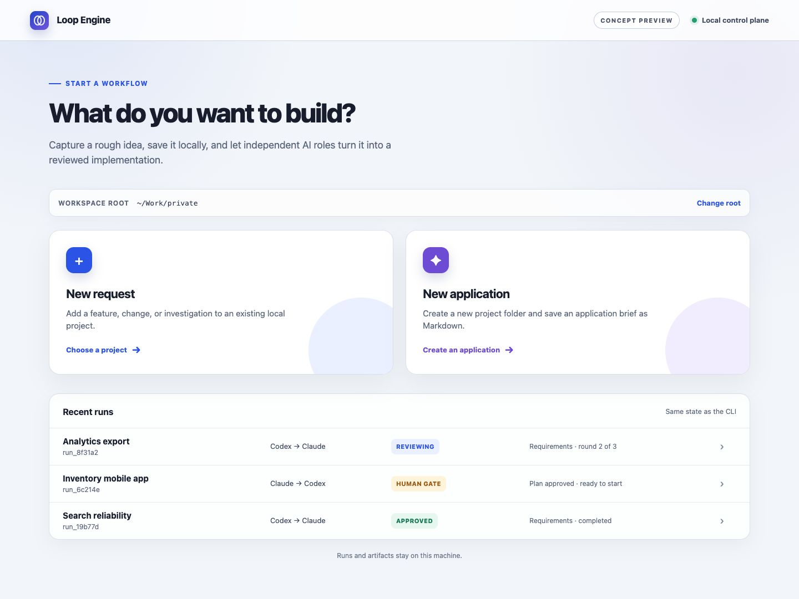

# Loop Engine

Loop Engine is a local orchestrator for AI-assisted software development. It turns a rough request into a structured workflow for requirements, architecture, implementation planning, implementation, verification, review, and revision.

Codex and Claude Code do not call each other recursively. A central workflow engine written in Go assigns roles, invokes each provider, validates artifacts, evaluates approval gates, and persists the state required to continue safely.

## Concept preview

The local browser control plane is currently a reviewed design target, not a released interface. The capture below shows the intended entry point for creating a request or a new application.



## How it works

Loop Engine separates the workflow into three independent roles:

- **Designer** — clarifies the request and produces requirements, architecture, and implementation plans.
- **Implementer** — implements one approved milestone at a time and addresses required changes.
- **Reviewer** — independently evaluates artifacts, code changes, and verification results.

The provider that receives the initial request can be selected with `--designer codex` or `--designer claude`. With the two-provider MVP, the selected provider is assigned to the Designer and Implementer roles in separate sessions, while the other provider becomes the independent Reviewer.

```text
Rough request
    -> Designer artifact
    -> Independent review
    -> Revision when required
    -> Deterministic gate
    -> Next workflow phase
```

## Core principles

- Artifacts, schemas, job IDs, and hashes are authoritative; terminal text is not.
- Designer, Implementer, and Reviewer use separate role IDs and agent sessions.
- The Reviewer provider must differ from the Designer and Implementer provider.
- Review and revision loops are finite and never auto-approve at their retry limit.
- Provider adapters, runtime backends, and workflow logic remain separate.
- A reviewer verdict, a deterministic gate pass, and human authorization are distinct records.
- Human approval cannot override stale artifacts, failed verification, or required changes.
- Destructive Git operations, deployment, and merge actions are never implicit.

## Requirements

- macOS or Linux
- Codex CLI installed and authenticated
- Claude Code CLI installed and authenticated
- Go 1.23 or later when building from source

Herdr and tmux are optional. Loop Engine can fall back to direct process execution when neither is available.

## Build from source

```bash
go build -o bin/loop-engine ./cmd/loop-engine
```

The resulting binary does not require a Go runtime on the target machine.

## Quick start

Check the local environment first:

```bash
bin/loop-engine doctor --backend direct
```

Start the requirements, architecture, and implementation-plan loops from a Markdown request:

```bash
bin/loop-engine start \
  --project /path/to/project \
  --backend direct \
  --mode supervised \
  --designer codex \
  --request-file /path/to/request.md \
  --max-review-rounds 3 \
  --execute
```

After the plan is independently approved, authorize its exact SHA-256 and run the milestone loop:

```bash
bin/loop-engine approve \
  --project /path/to/project \
  --by "$USER" \
  --note "Approved for implementation"

bin/loop-engine implement \
  --project /path/to/project \
  --max-review-rounds 3 \
  --max-verification-attempts 3
```

Implementation starts only from a clean Git worktree. Each milestone is implemented, verified with the
approved executable-and-argument arrays, independently code-reviewed, and remediated when required. After all
milestones pass, Loop Engine reruns the complete verification set and performs a final independent review of the
cumulative diff before marking the run completed.

To start with Claude Code as the Designer and Codex as the Reviewer:

```bash
bin/loop-engine start \
  --project /path/to/project \
  --backend direct \
  --mode design-only \
  --designer claude \
  --request "Describe the product you want to build" \
  --execute
```

Direct execution supports requirements, architecture, planning, hash-bound human authorization, milestone
implementation, verification, independent code review, and finite remediation loops. Herdr and tmux currently
participate in backend detection; managed-session execution and resume remain separate work.

## Commands

```text
loop-engine start
loop-engine plan
loop-engine approve
loop-engine implement
loop-engine doctor
loop-engine status
loop-engine version
```

Run `loop-engine help` for the command overview.

## Runtime backends

Automatic backend selection uses the following priority:

1. Herdr
2. tmux
3. Direct process execution

Runtime backends only control processes and sessions. They do not define workflow state or determine whether an artifact is approved.

## Approval model

Loop Engine deliberately separates three decisions:

1. **Reviewer approval** confirms that the current artifact has no required changes or unresolved questions.
2. **Gate pass** confirms deterministic conditions such as schema validity, subject identity, provider separation, and required verification.
3. **Human authorization** permits a specific side-effecting phase in supervised mode and is bound to an exact artifact hash.

An `approved` string from an agent is therefore not sufficient by itself to advance the workflow.

## Artifacts

Run data is stored under the target project:

```text
.loop-engine/runs/<run-id>/
├── artifacts/
├── jobs/
├── reviews/
├── verification/
└── approvals/
```

Artifacts are versioned and reviewed by exact path and SHA-256. When a review requests changes, the next Designer session receives the previous artifact and the required findings. Reaching the review limit moves the run to a human decision state instead of silently approving it.

## Documentation

The current product and architecture documents are maintained in Japanese:

- [Requirements](docs/requirements.md)
- [Architecture](docs/architecture.md)
- [Document output design](docs/design/document-output.md)
- [Document output implementation plan](docs/implementation-plan-document-output.md)
- [Local browser control plane design](docs/design/local-control-plane.md)
- [Local browser control plane implementation plan](docs/implementation-plan-local-control-plane.md)
- [Shared agent instructions](AGENTS.md)
- [Claude Code instructions](CLAUDE.md)
- [Shared agent instructions (Japanese)](docs/ja/AGENTS.md)
- [Claude Code instructions (Japanese)](docs/ja/CLAUDE.md)

## Development

```bash
go test ./...
go vet ./...
go build ./cmd/loop-engine
```

Changes should be committed as focused units with titles that describe the implemented capability or fix.
