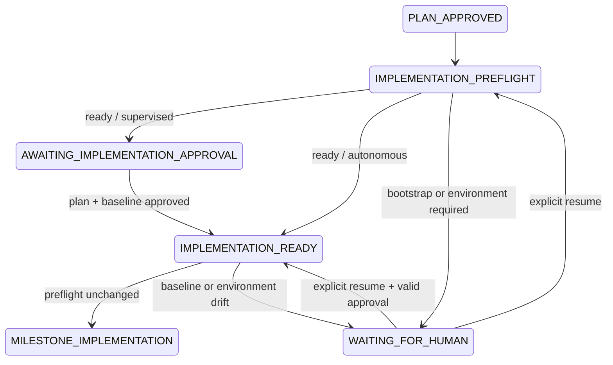

# Git Bootstrap / Implementation Preflight / Recovery 詳細設計

- 文書版: 0.1.1-draft
- 作成日: 2026-08-02
- 対応要件: `docs/requirements.md` 0.11.3-draft FR-230〜FR-245
- 対応ADR: `docs/architecture.md` ADR-011
- 状態: Claude Review承認済み、CLI Core Path実装済み

## 0. 実装状況（2026-08-07）

実装済み:

- `IMPLEMENTATION_PREFLIGHT`の実Workflow State化
- Managed Minimalおよび明示`--adopt-existing`による`rct init`
- `rct start --init-git`統合
- `/.rct/`除外、固定PathのStage、Hook/署名無効化、初回Baseline Commit、Receipt保存
- Git未初期化、Unborn HEAD、Dirty Worktree、Baseline Drift、Writer競合の回復可能な停止
- 同一Runを再利用する`rct resume`
- Baseline情報を持たない旧`AWAITING_IMPLEMENTATION_APPROVAL` / `IMPLEMENTATION_READY` RunのPreflight移行
- Plan HashとBaseline CommitへBindingしたHuman Approval
- Implementation Command全体を覆うProject Writer Lease
- Preflight、待機理由、具体的な次操作のCLI/Browser共通Progress反映

後続Increment:

- 旧VersionでGit不足により`FAILED`となったRunの限定Migration（G6）
- Browser IntakeからのGit Bootstrap Apply操作（G7。進捗表示とApproval UIは実装済み）
- Bootstrap途中失敗の部分完了Receiptからの詳細な冪等Recovery

この区分により、Git未初期化ProjectでPlan完了後に`rct implement`が即`FAILED`となる実機障害は
CLI Core Pathで解消済みである。一方、上記後続Incrementを含むFR-230〜FR-245全体の完了を示すものではない。

## 1. 目的

実装Reviewの正本であるGit差分を安全に取得できるBaselineを、rctが新規Application作成から
一貫して準備する。Git不足など利用者が修正可能な環境条件では承認済みArtifactを失敗扱いにせず、
同じRunを明示的に再開できるようにする。

この設計は次の実機障害を直接解消する。

```text
implement: inspect git worktree: ... fatal: not a git repository
```

## 2. スコープ

### 2.1 対象

- 新規Application DirectoryのGit初期化
- `/.rct/`のGit除外
- 初回Baseline Commit
- 既存非Git Directoryの明示Adopt
- Implementation Preflight
- 回復可能な停止と同一Run Resume
- Git不足で`FAILED`となった旧Runの限定Recovery
- CLIとLocal Browser Control Planeの共通Application Service

### 2.2 非対象

- Remote追加、Clone、Fetch、Pull、Push
- GitHub Repository作成
- Branch戦略、Pull Request、Merge
- Source Scaffold、Dependency install
- Dirty Worktreeの自動Commit、Stash、Reset、Clean
- 利用者のGit Author identityの自動生成またはGlobal Config変更
- 任意の`FAILED` Runを強制的に復活させる機能
- Review上限、Verification上限、Reviewer `blocked`などGit/Preflight以外の一般的な`resume`
- Linked WorktreeとSubmoduleのBootstrapまたはImplementation対応（v1ではFail Closed）

## 3. 設計原則

1. Git変更はAgentではなくrct Application Serviceだけが行う。
2. Read-onlyなPlanと明示Authorizationを、変更を行うApplyから分離する。
3. 最小InventoryのDirectoryと既存Fileを含むDirectoryを同じ自動化Levelで扱わない。
4. Initial Commitは確定済みInventoryだけを対象とし、Globや`git add .`を使わない。
5. Preflight不足は成果物の失敗ではないため、回復可能な停止として扱う。
6. ResumeはRun ID、State Revision、Artifact Hash、Baselineを再検証する。
7. ApprovalはPlanだけでなく実装開始CommitへBindingする。
8. Remote操作、Hook、署名、Shell評価をBootstrapへ持ち込まない。

## 4. Repository分類

`RepositoryInspector`はFile変更前に次のClassificationを返す。

| Classification | 条件 | Default action |
|---|---|---|
| `existing_repository` | 有効なRepository RootとHEADがある | Clean検査へ進む |
| `managed_minimal_uninitialized` | Git Repository外で、`.rct/`を除くEntryが選択Requestと任意の`.gitignore`だけ | Intake有無に関係なく明示選択後にBootstrap可能 |
| `unmanaged_uninitialized` | Git Repository外で、Managed Minimal以外のEntryがある | Adopt Authorizationを要求 |
| `unborn_repository` | RepositoryはあるがHEADがない | Baseline Commit Planを作成 |
| `unsafe_repository_boundary` | Root逸脱、危険なNested Repository、metadata異常 | Fail Closed |

検査順:

1. Project PathをCanonical化し、許可Root内か検証する。
2. Project Path ComponentのSymbolic Linkを検査する。
3. `git rev-parse --show-toplevel`相当で親Repositoryを含めて探索する。
4. `.git`の有無だけで未初期化と判断しない。
5. HEAD、Worktree、Index、Repository RootとProject相対Pathを取得する。
6. 選択Request、Directory Inventory、任意のIntake ownershipを照合する。

親Repositoryが見つかった場合、Nested `.git`は作らない。MVPではRepository全体がCleanであることを
要求し、Project Subdirectoryだけを独立Baselineとして扱わない。

CLIのManaged Minimal判定はIntake provenanceを必要としない。Canonical Project直下で、`.rct/`を除いた
Entryが`--request-file`で選択された一つの通常Fileと任意の通常File `.gitignore`だけであれば候補となる。
TTY確認または非対話の`--yes`は引き続き必須である。その他のFile、Directory、特殊Fileが一つでもあれば
Adopt Modeを要求する。

v1では次を`unsafe_repository_boundary`として明示的に拒否する。

- `.git`が`gitdir:`を指すFileであるLinked Worktree
- Project自身がGit Submoduleである構成
- Project InventoryにGit Submodule Entryを含む構成

## 5. CLI契約

### 5.1 Git Bootstrap

```text
rct init \
  --project <path> \
  [--request-file <path>] \
  [--adopt-existing] \
  [--yes] \
  [--json]
```

- `--adopt-existing`なしではManaged Minimal Inventoryを持つDirectoryに限定する。Intakeは必須でない。
- TTYではApply前にInventory、File数、合計Size、Digest、Commit Messageを表示する。
- 非TTYでは変更を伴う実行に`--yes`を要求する。
- `--adopt-existing --yes`は既存FileをBaselineへ含める強いAuthorizationとして監査記録へ残す。
- 既存の有効なRepositoryでは変更せず、現在Baselineを表示して成功する。

### 5.2 Start統合

```text
rct start \
  --request-file request.md \
  --init-git \
  --execute \
  --until plan
```

`--init-git`はBootstrap Serviceへの明示Authorizationである。Managed Minimalを超えるDirectoryでは、さらに
`--adopt-existing`または事前の`rct init`を要求する。`start`独自のGit処理は実装しない。

### 5.3 Resume

```text
rct resume --project <path> [--run <run-id>] [--json]
```

Resumeは実行前にRecovery Planを出力する。

```text
Run: run_...
Reason: GIT_BOOTSTRAP_REQUIRED
Resume target: AWAITING_IMPLEMENTATION_APPROVAL
Preserved: requirements, architecture, plan, reviews
Revalidation: plan hash, artifact hashes, bootstrap receipt, HEAD, worktree, revision
Action: resume this run without regenerating agent artifacts
```

## 6. Application Service

```go
type GitBootstrapMode string

const (
    GitBootstrapManaged GitBootstrapMode = "managed"
    GitBootstrapAdopt   GitBootstrapMode = "adopt_existing"
)

type GitBootstrapPlan struct {
    ID                 string
    Project            string
    RepositoryClass    string
    Mode               GitBootstrapMode
    ExpectedRevision   uint64
    Inventory          []BaselineEntry
    InventorySHA256    string
    GitignoreBeforeSHA string
    GitignoreAfterSHA  string
    CommitMessage      string
}

type GitBootstrapReceipt struct {
    SchemaVersion      string
    PlanID             string
    Project            string
    RepositoryRoot     string
    ProjectRelative    string
    Mode               GitBootstrapMode
    InitialCommit      string
    InventorySHA256    string
    Entries            []BaselineEntry
    GitignoreBeforeSHA string
    GitignoreAfterSHA  string
    CreatedAt          time.Time
}

type GitBootstrapService interface {
    Plan(context.Context, GitBootstrapInput) (GitBootstrapPlan, error)
    Apply(context.Context, GitBootstrapPlan, BootstrapAuthorization) (GitBootstrapReceipt, error)
}
```

`Plan`はRead-only、`Apply`はState changing operationとする。`Apply`はProject Lockを取得後に
InventoryとExpected Revisionを再計算し、一致しない場合は一度もGit変更を行わない。

Project LockはRun Directory配下の既存`state.lock`とは別に、Project全体で一つのWriter Leaseとして
`.rct/project-writer.lock`へ置く。OS advisory lockを所有権の正本とし、Run ID、Process ID、取得時刻などの
Metadataは診断用途だけに使う。Bootstrap ApplyとResumeは変更・遷移中だけLeaseを保持し、
`rct implement`は§12.1の期間を通して保持する。

## 7. Baseline Inventory

各Entryは次を含む。

```json
{
  "path": "request.md",
  "kind": "regular_file",
  "size": 2048,
  "sha256": "...",
  "mode": "100644"
}
```

- PathはProject相対のslash区切りとする。
- Sort順を固定してInventory全体のSHA-256を計算する。
- Regular FileはSize上限内で内容Hashを取得する。
- Symbolic LinkはTarget文字列をHash化し、Targetを辿らない。
- `.git`と`.rct`は常に除外する。
- Socket、Device、FIFOなど通常FileでないEntryは拒否する。
- Inventory確認後にPath、Size、Mode、Hashが変わればApplyを拒否する。

Managed Modeでは、Intake provenanceに関係なく、利用者が選択したRequest FileとBootstrap Planが更新する
`.gitignore`だけを対象とする。その他のEntryがある場合はAdopt Modeなしに続行しない。

## 8. `.gitignore`契約

- Rootの`.gitignore`へ`/.rct/`を一行として追加する。
- 既に`/.rct/`または意味的に同等のRoot除外がある場合は重複追加しない。
- 既存内容、改行形式、末尾改行を可能な限り保持する。
- 既存`.gitignore`がSymbolic Linkまたは通常File以外なら停止する。
- 変更前後HashをBootstrap PlanとReceiptへ保存する。
- Global excludeや`.git/info/exclude`だけに依存しない。

## 9. Git Command Policy

CommandはShellを介さず引数配列で実行する。

許可する操作:

```text
git rev-parse ...
git status --porcelain=v1 -z --untracked-files=all
git init
git add -- <exact paths...>
git commit --no-verify -m <fixed message>
```

Commit実行時はrct所有の空Hooks Directoryを`core.hooksPath`として指定し、`commit.gpgsign=false`を
一時設定する。Global Config自体は変更しない。Author name/emailが解決できなければApply前に停止する。

禁止する操作:

```text
push / fetch / pull / remote add
reset / clean / checkout / restore / stash
git add . / git add -A
利用者入力を含むShell command
```

## 10. 初回Commit Transaction

Managed Modeの処理順:

1. Git、Author identity、Path、Ownership、Lockを検査する。
2. Bootstrap PlanとInventory Digestを確定する。
3. 利用者Authorizationを検証する。
4. Lock内でInventoryとRepository分類を再検査する。
5. RepositoryがなければTemplate Hookを取り込まず初期化する。
6. `.gitignore`をAtomic writeする。
7. 確定済みPathだけをStageする。
8. Hookと署名を無効化して初回Commitを作成する。
9. HEAD、Clean Worktree、追跡対象を再検査する。
10. Bootstrap ReceiptをAtomic writeしEventを追記する。

Commit MessageのDefaultは`chore: initialize project for rct`とする。

Bootstrap ApplyのProject Writer Leaseは手順4の再検査前に取得し、ReceiptとEventの永続化が完了するか、
Interruptionを記録して処理を終了するまで解放しない。

## 11. Failureと部分完了

変更前検査で検出できるFailureは、Git metadata作成前に返す。

| Failure | State | 自動処理 |
|---|---|---|
| Git executableなし | WAITING_FOR_HUMAN | なし |
| Author identityなし | WAITING_FOR_HUMAN | なし |
| Inventory drift | WAITING_FOR_HUMAN | なし、再Plan |
| Project Lock競合 | 現State維持 | なし |
| `.gitignore`競合 | WAITING_FOR_HUMAN | 上書きしない |
| Commit失敗 | WAITING_FOR_HUMAN | 部分完了Receiptを保存 |
| unsafe repository boundary | BLOCKED | なし |
| State/Artifact破損 | FAILED | Fail Closed |

rctが今回新規作成した`.git`であっても、Apply途中で機械的に削除しない。別Processが利用を開始した可能性を
排除できないためである。部分完了Receiptから現在状態を再検査し、冪等に続行する。

## 12. Implementation Preflight

Planning承認後、次を検査する。

1. Plan ArtifactとReviewが有効である。
2. Repository RootとProject境界がPolicyに適合する。
3. HEADが存在する。
4. WorktreeとIndexがCleanである（`.rct/`は除外）。
5. Bootstrap Receiptが必要な場合は現在状態と一致する。
6. Project Writer Lockを取得できる。

成功時は次をRunへ保存する。

```json
{
  "repository_root": "/allowed/project",
  "project_relative": ".",
  "baseline_commit": "<40-or-64-hex>",
  "plan_sha256": "...",
  "checked_at": "..."
}
```

Supervised Modeではこの後にHuman Approvalを受け付ける。Approval Recordは`plan_sha256`と
`baseline_commit`を含む。`implement`開始直前に同じPreflightを再実行する。

### 12.1 Project Writer Leaseの保持範囲

`rct implement`は開始Preflightの再検査前にProject Writer Leaseを取得し、次のいずれかまで同じLeaseを
保持する。

- 全Milestone、Final Verification、Final Reviewが完了する
- `WAITING_FOR_HUMAN`、`BLOCKED`、`FAILED`、`COMPLETED`のいずれかへ確定遷移する
- ProcessがCancelまたはCrashし、OSがLockを解放する

Lease保持中はMilestone Implementation、Verification Command、Code Review Subject用Git Diff、Fix、
Final Verificationをすべて同一Writer区間として扱う。別RunはRequirements、Architecture、Planなど
Read-only工程を実行できるが、同じProjectの`IMPLEMENTATION_PREFLIGHT`を通過できない。

TransitionごとにLeaseを解放・再取得すると別RunがMilestone間へ割り込めるため、MVPでは実装Command全体の
連続Leaseを採用する。Crash後はMetadataを信用せずOS Lockを再取得し、HEAD、Index、Worktree、Run Eventを
Recovery検査してからだけ再開する。

## 13. 状態遷移



`WAITING_FOR_HUMAN`では次の構造化Interruptionを保存する。

```go
type PreflightInterruption struct {
    Code             string
    Phase            string
    ResumeState      domain.WorkflowState
    DetectedRevision uint64
    PlanSHA256       string
    BaselineCommit   string
    Remediation      []string
    CreatedAt        time.Time
}
```

## 14. Resume Contract

ResumeはReason CodeごとのHandlerを使用する。

Git Preflight Resume条件:

- Run IDとProjectが一致する
- Runが`WAITING_FOR_HUMAN`である
- Interruption CodeがGit Recovery対象である
- Expected Revisionが一致する
- Requirements、Architecture、Plan、Review Hashが保存値と一致する
- Git Bootstrap Receiptと現在Repositoryが一致する
- WorktreeがCleanである
- 同一Projectの別Writerがいない

Approval前Interruptionは`AWAITING_IMPLEMENTATION_APPROVAL`へ戻す。Approval後Interruptionは、Plan Hashと
Baseline CommitがApproval Recordと一致する場合だけ`IMPLEMENTATION_READY`へ戻す。

v1のResume HandlerはGit BootstrapとImplementation PreflightのReason Codeだけを登録する。その他の
`WAITING_FOR_HUMAN`理由を受け取った場合は対象外であることを明示し、Stateを変更しない。

## 15. Legacy Failed Run Recovery

旧VersionのGit不足Runは構造化Reasonを持たないため、次をすべて満たす場合だけMigration対象とする。

- `FAILED`直前が`IMPLEMENTATION_READY`
- Failure EventがImplementation開始前のGit inspectionであり、既知VersionのFailureが
  `inspect git worktree`と`not a git repository`など許可済みPatternに限定一致する
- Current MilestoneとImplementation Artifactが未作成である
- Approval対象Plan Hashと現在Plan Hashが一致する
- ArtifactとReviewがすべて有効である

Migration後は`WAITING_FOR_HUMAN / GIT_BOOTSTRAP_REQUIRED`へ置く。Bootstrap成功後、旧Approvalを
削除せず`superseded_at`と理由を記録し、`AWAITING_IMPLEMENTATION_APPROVAL`へ戻す。利用者は新しい
Baseline Commitへ再承認する。Agent Jobは再実行しない。

Legacy Failure文字列は補助Evidenceであり、それだけではRecoveryを許可しない。上記のState、Artifact、
Milestone、Approval Predicateをすべて満たすことを必須とする。

## 16. Browser統合

New application FormのGit選択はDefault ONだが、Confirmation画面で次を明示する。

- Git Repositoryを作成する
- `request.md`と`.gitignore`を初回Commitする
- `.rct/`はCommitしない
- Remote追加とPushは行わない
- Git Author identityが必要である

BrowserはIntakeへ選択を保存し、Shared `GitBootstrapService`を呼ぶ。Bootstrap成功前にRunを開始しない。
進捗表示は`GitBootstrapPlanned`、`GitRepositoryInitialized`、`GitBaselineCommitted`、
`ImplementationPreflightPassed` Eventを使用する。

## 17. Event

```text
GitBootstrapPlanned
GitBootstrapAuthorizationRecorded
GitRepositoryInitialized
GitignoreUpdated
GitBaselineCommitted
GitBootstrapCompleted
GitBootstrapInterrupted
ImplementationPreflightStarted
ImplementationPreflightPassed
ImplementationPreflightInterrupted
LegacyRunRecoveryPlanned
LegacyApprovalSuperseded
RunResumed
```

EventにFile内容、Environment、Credentialを含めない。InventoryはReceipt PathとDigestだけをEventへ含める。

## 18. Test方針

### Unit

- Repository分類
- Inventoryの決定性とSymlink非追跡
- `.gitignore`の重複防止と既存内容保持
- AuthorizationとExpected Revision
- Preflight Error分類
- ApprovalのPlan/Baseline Binding
- Legacy Recovery predicate

### Integration

- 新規Directoryから初回CommitとClean Worktreeを作る
- Git identity不足で変更前停止する
- Unborn RepositoryをBaseline化する
- 既存非空DirectoryをAdoptなしで拒否する
- Inventory driftをApply前に拒否する
- 親Repository配下でNested `.git`を作らない
- Linked WorktreeとSubmoduleをFail Closedで拒否する
- Hookが存在しても実行しない
- Commit失敗後の再実行が冪等である
- Project Lock競合で一件だけ成功する
- Git不足で旧`FAILED`となったFixtureを同じRun IDでApproval待ちへ戻す

Symbolic Link非追跡、no-followな`.gitignore`更新、親Repository、Linked Worktree、SubmoduleのIntegration
TestはmacOSとLinuxの両方で成功することをG3以降へ進むTechnical Gateとする。

### End-to-end

1. New applicationをGit Bootstrap付きで作成する。
2. Requirements、Architecture、Plan Loopを完了する。
3. Baseline CommitへHuman Approvalを記録する。
4. `rct implement`が同じBaselineから開始する。
5. 実装差分をClaude ReviewerがReviewする。

## 19. 実装順序案

```text
G0 Error taxonomy and repository classifier
  -> G1 Bootstrap plan, inventory, and authorization
    -> G2 Managed new-project init and initial commit
      -> G3 Implementation preflight before approval
        -> G4 Waiting interruption and explicit resume
          -> G5 Existing-directory adopt flow
            -> G6 Legacy failed-run recovery
              -> G7 Browser integration and live events
```

この順序はClaude Review承認後に別のImplementation Planとして確定する。
