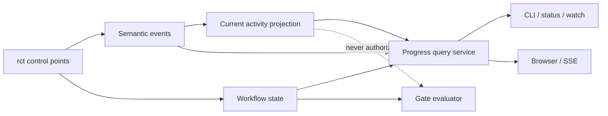
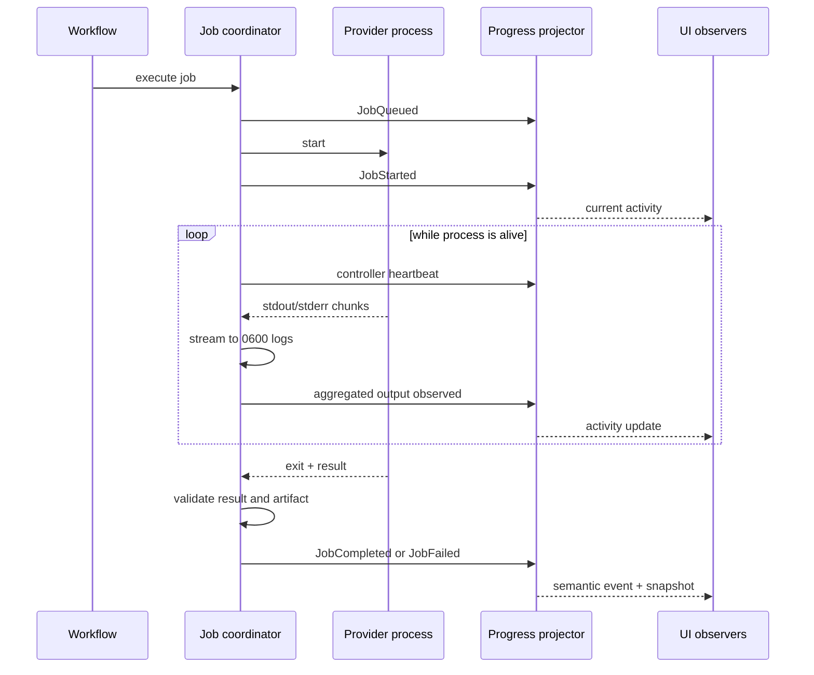

# Live Progress and Run Observability 詳細設計

- 文書版: 0.1.1-draft
- 作成日: 2026-08-03
- ステータス: Claude Review待ち
- 対応要件: `docs/requirements.md` 0.11.1-draft（FR-250〜270、AC-073〜084）
- 対応ADR: `docs/architecture.md` ADR-012

## 1. 目的

長時間の設計、Review、実装、検証中に「止まっているのか」「誰が何をしているのか」「次に人間の操作が
必要か」を、CLIとBrowserのどちらからでも同じ意味で確認できるようにする。

実運用では、Direct BackendでClaudeがPlan Round 2をReview中でもHerdrは`idle`であり、従来の`rct status`は
一つ前のReview VerdictとArtifact Pathだけを表示した。このためBackend画面とWorkflow進捗が混同され、現在の
Jobを把握できなかった。本設計はこの観測ギャップを解消する。

## 2. 設計原則

1. Workflow Stateは承認と遷移の正式状態であり、Progress表示から変更しない。
2. Current Activityは「今していること」の再構築可能なProjectionとする。
3. EventはAgentの文章でなくrctのSubmit、Wait、Validate、Gate制御点から発行する。
4. CLI、`watch`、Browserに個別の進捗判定を作らず、同じQuery Serviceを使う。
5. 根拠のないPercentage、ETA、成功推測を表示しない。
6. Raw Logと安全なProgress Summaryを分離する。
7. Observerの切断や遅延でProvider Jobを停止させない。

## 3. Scope

### 3.1 In scope

- Progress EventとCurrent ActivityのDomain Contract
- Job stdout/stderrの逐次保存
- Controller Heartbeatとstale表示
- Command実行中のLive Terminal表示
- `rct status`のCurrent Activity拡張
- `rct watch`による途中参加
- Browser Run Detail、SSE、Polling Fallback
- Direct、Herdr、tmuxの表示正規化
- Legacy Event LogのRead-only互換
- Security、Accessibility、Test Contract

### 3.2 Out of scope

- Agentの思考過程、非公開Chain of Thoughtの表示
- Token単位の全文Live StreamingをBrowserへ配信すること
- 根拠のない進捗率または完了予測
- BrowserからRaw Job Logを常時閲覧する機能
- 複数MachineにまたがるRemote Dashboard
- Progress UIを使ったWorkflow Gate判定

## 4. Authority model



Workflow State、Artifact Hash、Review Envelope、Human Approval RecordがAuthorityである。ActivityとRendererは
観測面であり、欠落、stale、再描画失敗があってもGateの結果を変えない。

## 5. Public progress model

### 5.1 Snapshot

```go
type ProgressSnapshot struct {
    SchemaVersion string
    RunID         string
    Project       string
    Backend       string
    Mode          string
    State         string
    StateRevision uint64
    Activity      *CurrentActivity
    Phases        []PhaseProgress
    LastEventSeq  uint64
    UpdatedAt     time.Time
}

type CurrentActivity struct {
    Revision            uint64
    Status              string // queued|running|waiting|completed|failed|cancelled|stale
    Phase               string
    Action              string
    Role                string
    Provider            string
    Backend             string
    JobID               string
    Round               int
    MaxRounds           int
    ArtifactKind        string
    CandidateVersion    int
    PreviousVerdict     string
    RequiredChangeCount int
    StartedAt           time.Time
    LastHeartbeatAt     time.Time
    WaitingReason       string
    Error               *SafeProgressError
}
```

`previous_verdict`は過去の確定結果であり、現在のReviewerがまだVerdictを出していない場合にCurrent Verdictとして
表示しない。`candidate_version`は生成・Review中のVersionであり、直前の承認済みArtifactと区別する。

### 5.2 Semantic event

```go
type ProgressEvent struct {
    SchemaVersion string
    Sequence      uint64
    Timestamp     time.Time
    RunID         string
    Type          string
    StateBefore   string
    StateAfter    string
    Phase         string
    Role          string
    Provider      string
    Backend       string
    JobID         string
    Round         int
    ArtifactKind  string
    Version       int
    Summary       string
    Data          map[string]SafeScalar
}
```

Semantic Event Type:

```text
RunStarted, RunWaiting, RunResumed, RunCompleted, RunFailed, RunCancelled
JobQueued, JobStarted, JobOutputObserved, JobCompleted, JobFailed, JobCancelled
ArtifactProduced, ReviewChangesRequested, ReviewApproved
VerificationStarted, VerificationCompleted
HumanActionRequired, HumanActionReceived
```

Heartbeatは高頻度のSemantic Logへ永続化せず、Activity Revision更新およびLive Transport Eventとして扱う。
`JobOutputObserved`も内容を含めず、最終出力観測時刻など必要最小限に抑制・集約する。

### 5.3 Phase projection

Phaseは少なくとも次の順序を持つ。

```text
intake -> requirements -> architecture -> plan -> implementation_approval
       -> milestones -> final_verification -> final_review -> completed
```

各Phase Statusは`not_started|running|changes_requested|approved|waiting|failed|completed`とする。Milestoneは
子項目として展開できる。Phase順序は表示用であり、不正なState遷移を補正しない。

## 6. Persistence

```text
.rct/runs/<run-id>/
├── state.json       # workflow authority snapshot
├── activity.json    # atomic current activity projection
├── events.jsonl     # ordered semantic events
└── jobs/<job-id>/
    ├── stdout.log   # mode 0600, streamed
    ├── stderr.log   # mode 0600, streamed
    └── result.json
```

### 6.1 Ordering and atomicity

- State変更を伴うEventはRun Writer Lock内でSequence採番、State Atomic Write、Event追記を順序保証する。
- Sequenceは独立Counterで事前予約しない。Writer Lock取得後、Disk上の最後の改行で確定したEvent Recordを
  再読込し、そのEffective Sequenceへ1を加えて採番する。`state.json`やMemory Cacheだけから推測しない。
- Crashが採番前またはAppend前に起きれば番号は消費されず、Append後に起きればRecordが次回Tailとなるため、
  未使用Sequence Gapを作らない。部分末尾Recordは確定Eventとして数えずRecovery対象にする。
- Activityは独立した`activity_revision`を持ち、Atomic Renameで更新する。
- HeartbeatはState RevisionとSemantic Sequenceを増やさない。
- ReaderはWriter Lockを取らず、Atomic Snapshotと改行で確定したJSONL行だけを読む。
- Event追記後にActivity更新へ失敗しても、次回QueryでEventとStateからProjectionを再構築できる。

### 6.2 Legacy events

Run作成時に`event_protocol_version`を固定する。FieldがないRunは`legacy-v0`としてRun終了まで扱う。
現行実装のようにSequenceあり・なしが混在する旧Event Logでも、Read-only互換Readerは各Recordに保存された
SequenceをAuthorityとせず、確定済み物理行番号をEffective Legacy Sequenceとして扱う。

Upgrade後の`plan`、`implement`、`resume`も、そのRunへはLegacy互換Recordを追記し、途中から
`progress-v1`へ切り替えない。既存Fileを移行目的で書き換えない。`status`、`watch`、SSEはEffective Legacy
SequenceをPublic IDとして利用できる。新規`progress-v1` RunだけがPersisted SequenceをAuthorityとし、欠落、
重複、逆行をErrorとする。

## 7. Job lifecycle



Providerが無出力でもProcessまたはBackend Sessionを観測できればHeartbeatは更新される。既定では10秒以内に
更新し、30秒以上更新されない場合は表示だけを`stale`へ変える。Recovery ManagerがProcess、Session、State、
Artifactを再検査するまでWorkflow Stateを`FAILED`にしない。

## 8. Streaming process runner

Process Runnerは全量`bytes.Buffer`を返す方式から、SinkへChunkを配送する方式へ移行する。

```go
type ProcessSink interface {
    Stdout([]byte) error
    Stderr([]byte) error
    Observed(stream string, at time.Time)
}

type ProcessResult struct {
    ExitCode          int
    DiagnosticStdout []byte // bounded tail only
    DiagnosticStderr []byte // bounded tail only
}
```

- stdout/stderrは別Fileへ生成順にWriteし、定期Flushする。
- Fileは新規作成時`0600`、Symbolic LinkをFollowしない。
- UI ConsumerへRaw ChunkをFan-outしない。
- Diagnostic Captureは上限を持つTail Bufferとし、秘密情報をPublic Errorへコピーしない。
- Disk Write ErrorはJob診断を失う重大Errorとして安全に停止する。
- 遅いObserverはBounded Queueから切り離し、Provider Processを無期限にBlockしない。

OS Pipe ReaderとDisk Writerも直接同期させず、stdout/stderrごとのByte上限付きQueueで分離する。Defaultは
各Stream 4 MiB、継続飽和判定は5秒とし、実装時に定数と負荷Testで固定する。Diskが追従できずQueueが継続して
上限へ達した場合、全Log保持とProcess継続を同時には保証できないため、Raw Outputを黙ってDropする代わりに次を行う。

1. Activityへ`LOG_SINK_BACKPRESSURE`を記録する。
2. Provider JobへCancelを送り、Grace Period後に強制終了する。
3. Pipe Readerは子Process回収までBounded Diagnostic TailへDrainし、追加内容が非永続であることを記録する。
4. 保存済みLogを`incomplete: true`としてFinal Job Diagnosticへ残す。
5. Workflowは通常のProvider成功として扱わず、安全な再試行Actionを提示する。

これによりSlow DiskがProviderを無期限にDeadlockさせることと、Log欠落を隠して成功扱いすることの両方を防ぐ。

## 9. CLI experience

### 9.1 Long-running commands

対象は`start --execute`、`plan`、`approve`後の継続処理、`implement`、`resume`とする。

```text
Requirements        ✓ approved after 2 rounds
Architecture        ✓ approved after 2 rounds
Implementation Plan ● Claude reviewing v2 · round 2/3 · 21s
Human approval      ○ waiting for Plan
Implementation      ○ not started

Last activity: 1s ago · direct · plan-r02-reviewer
```

TTYでは同じ表示領域を更新する。非TTYでは次のような安定した一行形式を追記する。

```text
2026-08-02T15:40:50Z job_started phase=plan role=reviewer provider=claude round=2/3 job=plan-r02-reviewer
```

Flags:

```text
--progress auto|tty|plain|jsonl|none
```

Progressはstderr、最終Resultはstdoutへ出す。`--json`はstdoutに単一JSONを維持する。非TTY、`NO_COLOR`、
`TERM=dumb`ではColorやCursor制御を必須にしない。

### 9.2 Status

`rct status --project <path> [--run <id>] [--json]`はSnapshotを一度表示する。Current Run未指定時は
`Source: project current-run pointer`を示す。現在Job、Role、Provider、Action、Round、Candidate、Elapsed、
Last Activity、Livenessを優先し、Artifact Pathの羅列は詳細部へ移す。

### 9.3 Watch

```text
rct watch --project <path> [--run <id>] [--follow] [--format plain|jsonl]
```

1. Snapshotを直ちに表示する。
2. `last_event_seq`以降のEventとActivity Revisionを追跡する。
3. File watcherが利用できない場合はBounded PollingへFallbackする。
4. `--follow`はTerminal Stateまで待ち、Signal受信時はWatcherだけを終了する。
5. WatcherはState、Current Pointer、Run Lockを変更しない。

## 10. Browser Run Detail

```text
┌─────────────────────────────────────────────────────────────────┐
│ new-ios-game-app · run_...                     LIVE · direct    │
│ PLAN_REVIEW · supervised                        last seen 1s ago │
├──────────────────────────────┬──────────────────────────────────┤
│ Current activity             │ Phase timeline                   │
│ Claude · Reviewer            │ ✓ Requirements (2 rounds)        │
│ Reviewing Plan v2            │ ✓ Architecture (2 rounds)        │
│ Round 2 of 3 · 00:21         │ ● Plan · reviewing v2            │
│ Previous: changes requested  │ ○ Human approval                 │
│ 3 required changes           │ ○ Implementation                 │
├──────────────────────────────┴──────────────────────────────────┤
│ Recent events                                                   │
│ 00:40 Plan v2 produced  · 00:40 Claude review started           │
├─────────────────────────────────────────────────────────────────┤
│ Artifacts                     Next action                        │
│ Requirements v2 · Arch v2     No action required while review   │
└─────────────────────────────────────────────────────────────────┘
```

DesktopではCurrent ActivityとTimelineを二Column、狭いViewportではActivity、Next Action、Timeline、Eventsの
順に一Column表示する。Human Approval待ちはSpinnerでなく`Waiting for your approval`と対象Hash、Actionを示す。

状態表現:

| State | Text | Icon/shape | Motion |
|---|---|---|---|
| completed/approved | Completed / Approved | check | none |
| running | Running | filled circle | optional subtle pulse |
| changes_requested | Changes requested | revision arrows | none |
| waiting | Waiting for ... | pause | none |
| failed/stale | Failed / Connection stale | warning | none |

Colorだけを意味に使わず、Reduced MotionではPulseを無効化する。Live RegionはPhase変更、Failure、Human Actionだけを
`polite`または必要時`assertive`に通知し、Heartbeatは読み上げない。

## 11. Query API and live transport

```text
GET /api/v1/runs/{run-id}
GET /api/v1/runs/{run-id}/activity
GET /api/v1/runs/{run-id}/events?after_seq=<n>&limit=<n>
GET /api/v1/runs/{run-id}/stream
```

SSE Event例:

```text
id: 42
event: progress
data: {"schema_version":"progress-v1","sequence":42,"type":"JobStarted",...}
```

- `Last-Event-ID`またはQueryの`after_seq`からReplayする。
- 接続維持用SSE CommentはRun Heartbeatと区別し、Semantic Sequenceを消費しない。
- Durable `events.jsonl`はRun存続中にPruneまたはRewriteしない。Server内のLive Fan-out Backlogだけを
  256 Eventまたは1 MiBの小さい方へBoundし、その範囲外のReconnectはDurable LogからPage単位でReplayする。
- Reconnect時は現在のDurable High-water Markを確定し、`Last-Event-ID + 1`からHigh-water MarkまでReplay後、
  それより新しいLive Eventへ接続する。ReplayとLive登録の境界でEventを欠落させない。
- Durable Sequence Gap、破損、Schema不一致は`resync_required`を返し、ClientはSnapshotを再取得する。
  In-memory Backlog外であることだけを`resync_required`理由にしない。
- ClientはSequenceでDeduplicateする。
- SSE不能時はSnapshotとEvents APIのPollingへFallbackする。
- Browser切断、Tab非表示、Slow ConsumerをRun Cancelへ結び付けない。
- Client送信Queueが256 Eventまたは1 MiBを超えたSlow ConsumerはServerが接続を閉じる。Clientは
  `Last-Event-ID`で再接続し、Durable Logから追いつく。切断をWorkflow Errorとして表示しない。

## 12. Backend normalization

| Logical lifecycle | Direct | Herdr | tmux |
|---|---|---|---|
| queued | child process request | owned agent submit pending | owned pane submit pending |
| running | process started/alive | submitted owned job observed | submitted owned command observed |
| heartbeat | process liveness | owned session/job probe | owned pane/process probe |
| completed | exit + valid result | wait outcome + valid result | process outcome + valid result |

Backend固有の`idle`、Pane Contents、Session名はDetailsに保持できるが、rctのRun IDとJob IDへ所有関係が確立し、
Submit済みでなければCurrent Activityへ使わない。Herdrが存在しても`--backend direct` Runの進捗はDirect Processから
観測する。

## 13. Error and security model

Public Error:

```json
{
  "code": "PROVIDER_PROCESS_EXITED",
  "summary": "Claude reviewer exited before producing a valid review",
  "provider": "claude",
  "phase": "plan",
  "job_id": "plan-r02-reviewer",
  "retryable": true,
  "next_action": "Inspect the local job directory, then resume the run"
}
```

Public DTOから除外するもの:

- Prompt本文とAgent思考過程
- Raw stdout/stderr
- EnvironmentとCredential
- 任意Project File本文
- Defaultでは絶対Path
- Token、Cookie、Authorization Headerらしい値

CLIはLocal Operator向けにJob Directoryを示してよいが、BrowserにはRun配下の安全な相対参照だけを返す。
Error Summaryは既知Error Codeから構築し、Raw stderrの先頭行を無検査で使用しない。

## 14. Failure and recovery

| Failure | UI behavior | Workflow behavior |
|---|---|---|
| Provider non-zero exit | failed + safe action | existing failure policy |
| Heartbeat overdue | stale + rechecking | no automatic failure |
| Browser/SSE disconnect | reconnecting | unchanged |
| Activity write failure | degraded observability warning | reconstruct or safely stop writer |
| Event gap | snapshot resync | unchanged |
| Controller crash | last activity becomes stale | Recovery Manager inspects |
| Log disk write failure | diagnostic storage failure | safely stop current job |

## 15. Test strategy

### Unit

- StateとActivityのAuthority分離
- Event Sequence、Legacy Reader、Projection再構築
- TTY/plain/JSONL Rendererとstdout/stderr分離
- Heartbeat/staleをFake Clockで検証
- Public DTO Redaction

### Integration

- Fake ProcessのChunkが終了前にLogへ現れる
- Crash後も書込済みLogとSnapshotを読める
- 複数WatcherがWriterをBlockしない
- SSE Replay、Deduplicate、Gap Resync、Polling Fallback
- Direct/Herdr/tmux Fixtureが同じLogical Sequenceへ正規化される

### UI

- Plan Round 2 Review中にCurrent JobとPrevious Verdictが正しく分離される
- Running、Revision、Waiting Approval、FailureのVisual Regression
- Keyboard、Screen Reader、200% Zoom、Reduced Motion、狭いViewport
- Fake Credential、Absolute Path、Raw LogがDOMへ出ない

通常CIでは実Codex/Claudeを起動しない。Fake Providerで決定的に検証し、実Provider Smoke Testは明示実行に分離する。

## 16. Incremental rollout

1. P0: Event Contract、Activity Store、Legacy Reader、Projection Test
2. P1: Streaming Process Runner、Heartbeat、安全なError
3. P2: Long-running Command Renderer、`status`拡張、`watch`
4. P3: Progress Query API、SSE Replay、Polling Fallback
5. P4: React/TypeScript Run Detail、Accessibility、Visual Test

P0〜P2でCLIのみでも実行状況を把握できるようにし、P3〜P4は同じContractをBrowserへ接続する。Browser実装のために
Core Workflowを作り直さない。

`docs/implementation-plan-local-control-plane.md`のL5は、本設計のP0〜P4完了を前提とする。P0〜P2はCore/CLIの
先行Milestoneとして実施し、L5内でP3〜P4をProgress Query APIとRun Detailへ接続する。L0〜L4はProgress UIを
待たず進められるが、L5のAcceptanceはP0〜P4を満たすまで完了としない。

## 17. Review points

Claude Reviewでは特に次を確認する。

1. ActivityがGate Authorityへ昇格する経路が残っていないか。
2. Sequence、State Revision、Activity Revisionの整合性とCrash境界は十分か。
3. Streaming LogのBackpressureとDisk Error方針はProviderを安全に制御できるか。
4. Heartbeat 10秒、stale 30秒のDefaultとRecovery意味が妥当か。
5. SSE Replay、Gap、Slow Consumer、Polling Fallbackに欠落がないか。
6. Public Progress DTOから秘密情報とRaw Logを排除できているか。
7. CLIとBrowserがCurrent Job、Previous Verdict、Candidate Versionを誤認させないか。
8. Direct、Herdr、tmuxの所有関係と正規化境界が十分か。
